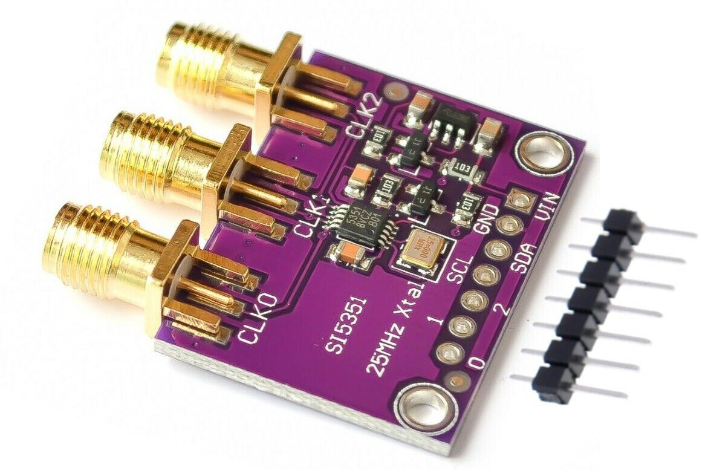

# si5351_clock_gen
### Overview
This is a basic example program to use the Si5351 programmable clock generator.  
Communication and configuration loading is done through the I²C protocol.  
This code is written for an STM32F030 MCU but can be adapted to any other MCU with I²C capabilities.  
In this example program, output CLK0 of the Si5351 module generates a 300kHz clock.  

### Pin connections
| STM32F030 Pin | Si5351 Pin |
|---------------|------------|
| PB6 | I²C SCL |
| PB7 | I²C SDA |
| GND | GND |
| 3.3V | VIN |
### Links
[stm32f030 datasheet](https://www.st.com/resource/en/datasheet/stm32f030f4.pdf)  
[stm32f030 reference manual](https://www.st.com/resource/en/reference_manual/rm0360-stm32f030x4x6x8xc-and-stm32f070x6xb-advanced-armbased-32bit-mcus-stmicroelectronics.pdf)  
[Si5351 datasheet](https://cdn-shop.adafruit.com/datasheets/Si5351.pdf)  
[Si5351 additional info on registers](https://www.skyworksinc.com/-/media/Skyworks/SL/documents/public/application-notes/AN619.pdf)  
